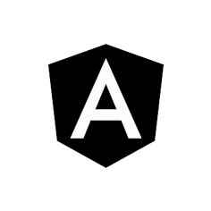
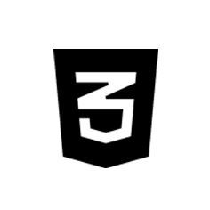
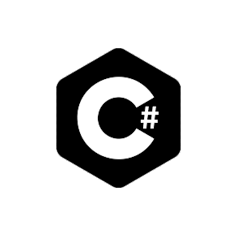
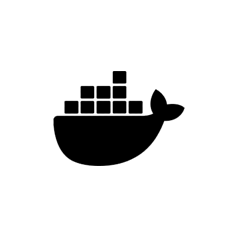
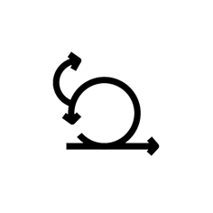

  

## Ingeniero de Teleco desarrollando `software` desde hace más de 10 años.

- 🔭 Estoy trabajando como desarrollador en [Plain Concepts](https://www.plainconcepts.com/es/).
- 👨‍💼 He colaborado con clientes de sectores muy diversos: retail, pesca, acuicultura, restauración, energía, banca...
- 🌱 Actualmente estoy explorando temas relacionados con la inteligencia artificial y la productividad.
- 💬 Podemos charlar sobre desarrollo personal, trato con el cliente, agilismo, finanzas personales, inversión, bitcoin...
- 🏹 Entre mis aficiones, dibujo en mis ratos libres, disfruto del tiro con arco y estoy aprendiendo a tocar la batería.
- 🧗‍♂️ Padre a tiempo completo de dos hijos maravillosos.
- 📫 Puedes contactarme por email en **alexpazdom@gmail.com** o través de mi **[LinkedIn](https://www.linkedin.com/in/alexpaz-software-developer)**.
- 💻 Herramientas, tecnologías y lenguajes que he tocado hasta la fecha 👇👇👇

<table border="0" style=" margin: 20px; width: 100%; border-collapse: collapse; text-align: left;">
  <tbody>
    <tr>
      <td style="width: 10%;"></td>
      <td style="width: 25%;">android</td>
      <td><a href="https://developer.android.com/" target="_blank">developer.android.com</a></td>
    </tr>
    <tr>
      <td></td>
      <td>ios</td>
      <td><a href="https://developer.apple.com/" target="_blank">developer.apple.com</a></td>
    </tr>
    <tr>
      <td></td>
      <td>ionic</td>
      <td><a href="https://ionicframework.com/" target="_blank">ionicframework.com</a></td>
    </tr>
    <tr>
      <td></td>
      <td>cordova</td>
      <td><a href="https://cordova.apache.org/" target="_blank">cordova.apache.org</a></td>
    </tr>
    <tr>
      <td></td>
      <td>angular</td>
      <td><a href="https://angular.io/" target="_blank">angular.io</a></td>
    </tr>
    <tr>
      <td></td>
      <td>vuejs</td>
      <td><a href="https://vuejs.org/" target="_blank">vuejs.org</a></td>
    </tr>
    <tr>
      <td></td>
      <td>javascript</td>
      <td><a href="https://www.javascript.com/" target="_blank">javascript.com</a></td>
    </tr>
    <tr>
      <td></td>
      <td>typescript</td>
      <td><a href="https://www.typescriptlang.org/" target="_blank">typescriptlang.org</a></td>
    </tr>
    <tr>
      <td></td>
      <td>html5</td>
      <td><a href="https://www.w3.org/html/" target="_blank">w3.org/html</a></td>
    </tr>
    <tr>
      <td></td>
      <td>css3</td>
      <td><a href="https://www.w3schools.com/css/" target="_blank">w3schools.com/css</a></td>
    </tr>
    <tr>
      <td></td>
      <td>cypress</td>
      <td><a href="https://www.cypress.io/" target="_blank">cypress.io</a></td>
    </tr>
    <tr>
      <td></td>
      <td>playwright</td>
      <td><a href="https://playwright.dev/" target="_blank">playwright.dev</a></td>
    </tr>
    <tr>
      <td></td>
      <td>csharp</td>
      <td><a href="https://www.w3schools.com/cs/" target="_blank">w3schools.com/cs</a></td>
    </tr>
        <tr>
      <td></td>
      <td>csharp</td>
      <td><a href="https://www.python.org/" target="_blank">python.org</a></td>
    </tr>
    <tr>
      <td></td>
      <td>dotnet</td>
      <td><a href="https://dotnet.microsoft.com/" target="_blank">dotnet.microsoft.com</a></td>
    </tr>
    <tr>
      <td></td>
      <td>sqlserver</td>
      <td><a href="https://www.microsoft.com/en-us/sql-server/" target="_blank">microsoft.com/en-us/sql-server/</a></td>
    </tr>
    <tr>
      <td></td>
      <td>postgresql</td>
      <td><a href="https://www.postgresql.org/" target="_blank">postgresql.org</a></td>
    </tr>
    <tr>
      <td></td>
      <td>mongodb</td>
      <td><a href="https://www.mongodb.com/" target="_blank">mongodb.com</a></td>
    </tr>
    <tr>
      <td></td>
      <td>swagger</td>
      <td><a href="https://swagger.io/" target="_blank">swagger.io</a></td>
    </tr>
    <tr>
      <td></td>
      <td>docker</td>
      <td><a href="https://www.docker.com/" target="_blank">docker.com</a></td>
    </tr>
    <tr>
      <td></td>
      <td>terraform</td>
      <td><a href="https://www.terraform.io/" target="_blank">terraform.io</a></td>
    </tr>
    <tr>
      <td></td>
      <td>aws</td>
      <td><a href="https://aws.amazon.com/" target="_blank">aws.amazon.com</a></td>
    </tr>
    <tr>
      <td></td>
      <td>azure</td>
      <td><a href="https://azure.microsoft.com/" target="_blank">azure.microsoft.com</a></td>
    </tr>
    <tr>
      <td></td>
      <td>gitlab</td>
      <td><a href="https://about.gitlab.com/" target="_blank">about.gitlab.com</a></td>
    </tr>
    <tr>
      <td></td>
      <td>jenkins</td>
      <td><a href="https://www.jenkins.io/" target="_blank">jenkins.io</a></td>
    </tr>
    <tr>
      <td></td>
      <td>git</td>
      <td><a href="https://git-scm.com/" target="_blank">git-scm.com</a></td>
    </tr>
    <tr>
      <td></td>
      <td>subversion</td>
      <td><a href="https://subversion.apache.org/" target="_blank">subversion.apache.org</a></td>
    </tr>
    <tr>
      <td></td>
      <td>grafana</td>
      <td><a href="https://grafana.com" target="_blank">grafana.com</a></td>
    </tr>
    <tr>
      <td></td>
      <td>jira</td>
      <td><a href="https://www.atlassian.com/es/software/jira" target="_blank">atlassian.com/es/software/jira</a></td>
    </tr>
    <tr>
      <td></td>
      <td>confluence</td>
      <td><a href="https://www.atlassian.com/es/software/confluence" target="_blank">atlassian.com/es/software/confluence</a></td>
    </tr>
    <tr>
      <td></td>
      <td>scrum</td>
      <td><a href="https://www.scrum.org/" target="_blank">scrum.org</a></td>
    </tr>
    <tr>
      <td></td>
      <td>photoshop</td>
      <td><a href="https://www.photoshop.com/" target="_blank">photoshop.com</a></td>
    </tr>
    <tr>
      <td></td>
      <td>gimp</td>
      <td><a href="http://www.gimp.org.es/" target="_blank">gimp.org.es</a></td>
    </tr>
    <tr>
      <td></td>
      <td>procreate</td>
      <td><a href="https://procreate.com/" target="_blank">procreate.com</a></td>
    </tr>
  </tbody>
</table>
